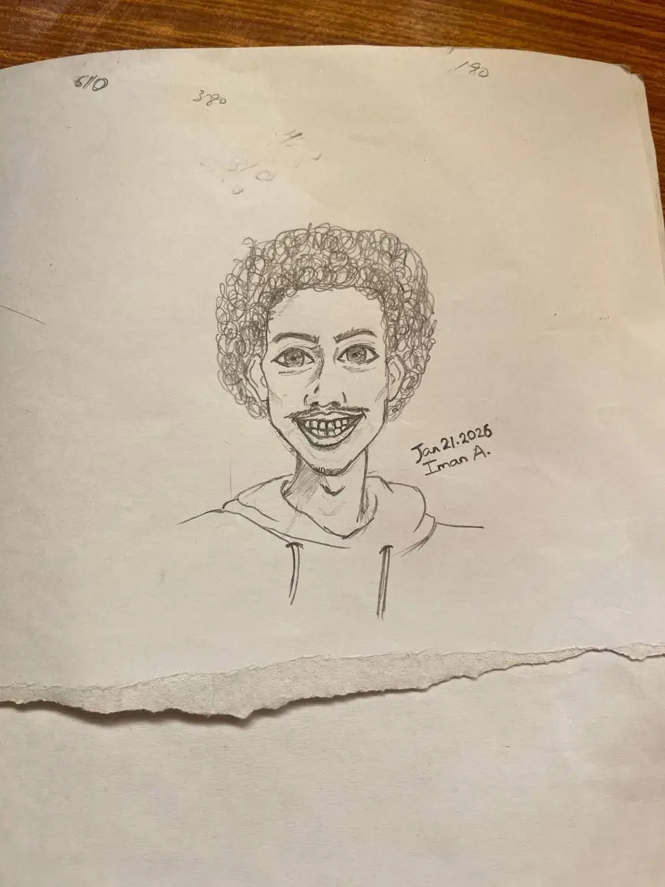

---
{
	"title": "The Beginning",
	"description": "Documenting my journey of Game, Programming, Art and Music",
	"date": "Feb 08, 2026",
	"thumbnail": "beginning.webp"
}
---
Hello there :D

As you probably could tell from the website's name, My name is Yordanos. It's an [Amharic](https://en.wikipedia.org/wiki/Amharic) name for the name 'Jordan'. This site is where I document myself trying (and often failing) to make games.

Here is a [caricature](https://en.wikipedia.org/wiki/Caricature) of me (you can find another one in the home page about tab)

heheh as you probably could tell, I really like [caricatures](https://en.wikipedia.org/wiki/Caricature) (a little too much, probably).

### Goals
Now enough with the introductions. Let get straight to the point of why I made this website and what my future plans are.

In the recent few years that I picked up game development, I've realized how much of an amazing hobby or even a potential career it is. It's a field of endless possibilities. Creation of your own world and rules. I believe it is truly the peak of Art where you live inside one's creation.
- A world made of cubes
- Monkeys fighting balloons
- A world full of bugs as residents
- Plants defending your house from zombies

Whatever your imagination can imagine... IT’S LIMITLESS
(Well… hardware limitations exist. We’ll ignore those for now.)

However, this endlessness is a double edged sword. The skills required for an individual to grow and learn this form of art is also near endless. I'm here to document my journey through this treacherous path and have a little bit of fun along the way ;D

I am programmer first. So I believe things like design, art and music will be the most... let's just say FUN paths haha. A technical person trying out a creative venture? I mean, How difficult can it be right?
> \*Phone ringing\*

> \*Pick up\*

> "Hello?"

> \*Phone noises\*

> "What? What do you mean design, art and music don't have debuggers?"
---
Here are what I plan to write and document about in this site:
- Devlogs of games I make, featuring my very respectable Michelangelo-level art skills (Michelangelo, age 2. On a bad day.)
- Write about systems and any techniques that I learn (Teaching is a good way of reinforcing what you have learned :D)
- Share my art and music/sound effects (oh God)
- Maybe post my personal opinion and takes on things like tech, news, and whatnot
- ... the list will get longer as I further my journey

So yeah. Thats my goal. A simple and a humble one. Join me for the ride. Things will break, and that’s kind of the point :D

Here are my links:
- [Telegram](https://t.me/theyordanos)
- [Github](https://github.com/theyordanos)
- [Itch Page](https://yordanos.itch.io)
